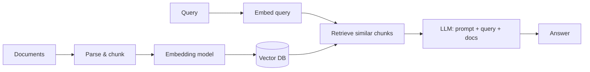

# Harnessing Ollama — Course Notes

*Prepared: 23 Sep 2026*

Section-by-section notes from the lecture transcripts of [Harnessing Ollama: Create Local LLMs with Python](https://www.coursera.org/learn/packt-harnessing-ollama-create-local-llms-with-python-8hrb5) (Packt, Coursera): 9 modules, 42 videos, about 3 hours.

## Module 1 — Introduction

The course teaches you to build free, local LLM apps in Python with Ollama. It covers custom models, RAG systems and tool calling.

### 1.1 Introduction & What You Will Learn (2m)

- The instructor is Paulo Dichone, a software, cloud and AI engineer.
- Course goals:
  - Build local LLM applications with Ollama.
  - Customize models and try different "flavors" of models.
  - Build **RAG (Retrieval-Augmented Generation)** systems powered only by Ollama models.
  - Use **tools / function calling** to extend what LLMs can do.
  - Build full LLM applications, **all free**.
- Audience: developers, AI/ML engineers, data scientists and open-minded learners.

### 1.2 Course Prerequisites (2m)

- Basic programming skills, mainly **Python**.
- A general understanding of AI, ML and LLMs. You don't need to be an expert.
- This is not a programming course. It is mostly **hands-on**, with some theory.

### 1.3 Demo: What You'll Build (4m)

- A **RAG "Document Assistant"** that answers questions about an uploaded PDF. The demo PDF is about Beneficial Ownership Information (BOI) reporting.
- Behind the scenes, the app loads the document, creates embeddings, retrieves the relevant chunks and sends them with the prompt to the LLM.
- Example questions: "When should I file BOIR?", "How to report beneficial ownership?", "What are the penalties?"
- The whole system runs locally through Ollama, with no OpenAI and no cost.

### 1.4 Development Environment Setup (1m)

- You need **Python** installed and a code editor. The instructor uses **VS Code**.
- For help installing Python, the instructor recommends the Python install guide in Kinsta's knowledge base.

## Module 2 — Ollama Deep Dive: Introduction and Setup

Ollama is a free, local "model manager". You install it once, pull models, and chat with them from the terminal.

### 2.1 What is Ollama and its Advantages (6m)

- **Ollama** is an open-source tool that makes it simple to **run LLMs locally** on your own hardware, for free. Services like ChatGPT are paid.
- It sits at the center and lets you **pick different LLMs** for each situation.
- At its core it is a **CLI**. It handles installing and running models and hides the setup complexity.
- **The problem it solves:** a RAG pipeline needs several models, and those are usually paid APIs.
  - The pipeline: documents → chunks → embedding model → vector DB.
  - A query is embedded the same way → similarity search → LLM → response.
- **Advantages:**
  - **Local control:** models are downloaded to your machine.
  - **Privacy & security:** data is never sent to external servers. This is key for sensitive data.
  - **Simplified setup:** no ML-framework or hardware configuration needed.
  - **Cost efficiency:** no ongoing API or server costs.
  - **Lower latency:** no network round trips, so responses are faster.
  - **Customization:** you can customize or fine-tune models without third-party limits.

### 2.2 Key Features and Use Cases (4m)

- **Key features:**
  - **Model management:** easily download and switch between LLMs. This is the main point of Ollama.
  - **Unified interface:** one consistent set of commands works for every model.
  - **Extensibility:** you can add custom models and extensions.
  - **Performance optimization:** Ollama uses your hardware well, including **GPU acceleration** if you have it.
- **Use cases:**
  - **Development & testing:** swap models to find the best one for a task.
  - **Education & research:** experiment without the barriers of cloud services.
  - **Secure applications:** suits fields like healthcare and finance, where data privacy is critical.
- Ollama tackles **accessibility, privacy and cost**, which **democratizes** AI.

### 2.3 System Requirements (1m)

- **OS:** macOS, Linux or Windows.
- **Storage:** about **10 GB free**, because models are large.
- **CPU:** any modern processor.

### 2.4 Download & Set Up Ollama + Llama 3.2 (8m)

- Go to **ollama.com** → Download.
  - **Mac / Windows:** download and run the app.
  - **Linux:** run the install command in a terminal.
- On Mac: unzip → move to Applications → open → **install the command-line tool** → run your first model.
- When the Ollama (llama) icon shows in the menu bar, Ollama is running.
- Start a model and open a chat shell: `ollama run llama3.2`
- Useful commands inside the chat shell:
  - `/?` or `/help`: lists commands (`/set`, `/show`, `/load`, `/save`, `/clear`, `/bye`).
  - `/show info`: shows model details (architecture, parameters, context length, embedding length, quantization).
  - `/clear`: clears the session context.
  - `/bye`: exits the shell.
- Tip: Llama 3.2 is **verbose**. Prompts like "In short, tell me…" get shorter answers.
- Ollama itself is only the **manager**. You still need to pull an actual model, such as Llama 3.2.

### 2.5 Ollama Models Page Overview (7m)

- **ollama.com/models** lists all available models. You can filter them by featured, most popular or newest.
- A model page shows:
  - its tags (for example *tools*, *1B*, *3B*)
  - its pull count
  - a dropdown of variants, each with its size (Llama 3.2 3B is about 2 GB)
  - the run command, a README, and benchmarks
- **Llama 3.2 3B (default):** good at following instructions, summarization, prompt rewriting and tool use.
- **Llama 3.2 1B:** a smaller model. Good for personal information management, multilingual retrieval, rewriting and **running on edge devices**.
- To pull and run the 1B model: `ollama run llama3.2:1b`. It downloads the model first, then starts it.
- `ollama list` lists every model you have downloaded locally.
- **Key idea:** always test several models. No single model fits every use case.

### 2.6 Model Parameters Deep Dive (6m)

What the fields in `/show info` mean:

| Field                         | Meaning                                                                                                                             |
|-------------------------------|-------------------------------------------------------------------------------------------------------------------------------------|
| Architecture (llama)          | Built by Meta and designed for efficiency, so it performs well even at small sizes.                                                 |
| Parameters (e.g. 3.2B)        | Weights and biases learned in training; **3.2B = 3.2 billion**. More parameters usually means more accurate but needs more compute. |
| Context length (e.g. 131,072) | Maximum **tokens** the model can take in one input. Longer means it handles long documents and conversations.                       |
| Embedding length (e.g. 3,072) | Size of each token's vector (its dimensions). Higher means richer meaning, but more compute.                                        |
| Quantization (e.g. Q4)        | Weights stored at lower precision (4-bit), giving a **smaller, faster model that uses less memory**.                                |

### 2.7 Parameters vs Disk Size and Compute (3m)

- Bigger models need **much more disk space and compute**. Example: **Llama 3.1 405B is about 229 GB**.
- For most tasks, **8B (or even 70B)** models are enough.
- Treat benchmarks with caution because they can be inflated. Read the model page and test for your own use case.

## Module 3 — Ollama CLI Commands and the REST API

Everything you do in the CLI (pull, run, remove, customize) you can also do over the local REST API at `http://localhost:11434`.

### 3.1 Commands: Pull and Test a Model (4m)

| Command               | What it does                                                             |
|-----------------------|--------------------------------------------------------------------------|
| `ollama help`         | Lists commands: serve, create, show, run, stop, pull, push, list, ps, rm |
| `ollama list`         | Shows installed models (name, size, modified date)                       |
| `ollama pull <model>` | Downloads a model without running it                                     |
| `ollama run <model>`  | Runs a model and pulls it first if it's missing                          |
| `ollama rm <model>`   | Deletes a model to free disk space                                       |

- Example: `ollama pull codegemma:2b` (about 1.6 GB) → `ollama run codegemma:2b` → "Write me a Python function that returns hello world."
- **CodeGemma** is a set of lightweight coding models. It handles fill-in-the-middle, code completion and code generation.

### 3.2 LLaVA Multimodal Model: Caption an Image (5m)

- **LLaVA** is a **multimodal** model (vision encoder + LLM), so it understands **images and text**. Sizes: 7B, 13B, 34B. The 7B is about 4.7 GB.
- Run it with `ollama run llava:7b`, then pass an image path in the prompt, for example: `What is in this image? flower_1.png`
- It described the purple and white pansies correctly.
- It **remembers conversation context**, so follow-ups work ("write a short poem about that", "where do they grow best?").

### 3.3 Sentiment Analysis, Summaries & Customizing with a Modelfile (8m)

- General models like Llama 3.2 can do **sentiment analysis**. Example: "I am not willing to pay you back" → negative, confrontational.
- You can prompt for style, for example "Please be less verbose".
- **Modelfile** (no file extension) lets you customize a base model:

```
FROM llama3.2

# 0–1: higher = more creative, lower = more direct
PARAMETER temperature 0.3

SYSTEM """
You are James, a very smart assistant who answers questions succinctly and informatively.
"""
```

- Build it with `ollama create james -f ./Modelfile`, then `ollama run james`.
- The new model answers "My name is James" and keeps replies short.
- Remove it with `ollama rm james`.

### 3.4 REST API: Generate and Chat Endpoints (5m)

- While the Ollama app runs in the background, it serves an API at **`localhost:11434`**. The rest of the course builds on this API.
- **Generate** is a one-shot completion:

```bash
curl http://localhost:11434/api/generate -d '{
  "model": "llama3.2",
  "prompt": "Tell me a fun fact about Portugal",
  "stream": false
}'
```

- Without `"stream": false`, the response **streams** as many small JSON chunks, one word each. With it, you get one full response plus metadata.
- **Chat** takes a list of messages with roles:

```bash
curl http://localhost:11434/api/chat -d '{
  "model": "llama3.2",
  "messages": [{"role": "user", "content": "Tell me a fun fact about Mozambique"}],
  "stream": false
}'
```

- Warning: LLMs can **hallucinate**. The model made up a "fun fact" about Mozambique.

### 3.5 REST API: JSON Mode (3m)

- Add `"format": "json"` to the payload and ask for JSON in the prompt as well. The model then returns structured JSON.
- The full endpoint list is in the Ollama GitHub repo under **docs/api.md**. It includes copy model, show model info, delete, list and more, matching the CLI.

### 3.6 Models for Different Tasks: Summary (1m)

| Task                       | Example models        |
|----------------------------|-----------------------|
| Text generation            | Llama 3.x, Mistral    |
| Code generation            | Code Llama, CodeGemma |
| Multimodal (text + images) | LLaVA                 |

- Your job is to **test and choose** the model that works best for your use case.

## Module 4 — User Interfaces for Ollama Models

The **Msty** app puts a ChatGPT-style interface on top of your local Ollama models, including a no-code RAG "knowledge stack".

### 4.1 Ways to Interact with Ollama: Overview (2m)

There are four ways to use Ollama models:

1.  **CLI:** simple and direct (Modules 2–3).
2.  **UI-based interface:** a friendly front end backed by an Ollama model (this module).
3.  **REST API:** hit endpoints with cURL. It is the foundation for everything that follows.
4.  **Ollama Python library:** code-level control for building full LLM apps (Module 5 onward).

### 4.2 Msty App: Chat and RAG with Documents (11m)

- Download **Msty** from msty.app. It runs on Windows, Mac (Apple Silicon or Intel) and Linux.
  - One-click setup, with no Docker or terminal needed.
  - It works offline and keeps your data private.
- On first launch, choose **"Get started quickly using Ollama models"**. Msty finds the models you already installed (for example Llama 3.2 and LLaVA 7B).
- Pick a model from the dropdown and chat.
- **Images:** Llama 3.2 can't read images, so switch to **LLaVA 7B** for image questions.
- **Chat with documents (RAG):**
  1.  Click **Attach Knowledge Stack** → create a stack (for example "my tester").
  2.  Choose an **embedding model**, for example Nomic embed text. It is needed to turn the document into vectors.
  3.  Drop in the PDF → click **Compose** to chunk and embed it.
  4.  Select the knowledge stack in the chat, then ask questions like "Give me a summary of the document" or "What are the penalties for not filing?"
- Tip: ask about "the document", not "the PDF". The model only sees text chunks, not the file.
- Why it matters: this is a **private, free, local ChatGPT**. You can use sensitive documents with no API costs or cloud.

## Module 5 — The Ollama Python Library

The `ollama` Python package wraps the REST API. `ollama.chat`, `generate`, `list`, `show`, `create` and `delete` each call the matching endpoint for you.

### 5.1 Why the Python Library (2m)

- **CLI:** fastest to use, but not scalable for real applications.
- **REST API:** does the same things through endpoints.
- **UI (e.g. Msty):** easy chat interface.
- **Python library:** gives you code-level control to **build real local LLM applications**.

### 5.2 Calling the REST API from Python with requests (5m)

- Set up a virtual environment first: `python3 -m venv venv` → `source venv/bin/activate` → `pip install requests`

```python
import requests, json

url = "http://localhost:11434/api/generate"
data = {"model": "llama3.2", "prompt": "Tell me a short story and make it funny"}

response = requests.post(url, json=data, stream=True)
if response.status_code == 200:
    for line in response.iter_lines():
        if line:
            chunk = json.loads(line.decode("utf-8"))
            print(chunk.get("response", ""), end="", flush=True)
```

- Ollama must be **running** in the background. Watch for URL typos, such as a missing `/api/`.

### 5.3 Chatting with a Model (6m)

- Install with `pip install ollama`.

```python
import ollama

print(ollama.list())   # installed models as JSON

res = ollama.chat(
    model="llama3.2",
    messages=[{"role": "user", "content": "Why is the sky blue?"}],
)
print(res["message"]["content"])
```

- The full response also has metadata: `done`, `total_duration`, `load_duration`, `prompt_eval_count`, `eval_count` and more.
- Other functions include `chat`, `generate`, `create`, `delete`, `embed`, `show` and `ps`.

### 5.4 Chat with Streaming (2m)

- `chat()` also accepts `tools`, `stream` and `format`.

```python
stream = ollama.chat(
    model="llama3.2",
    messages=[{"role": "user", "content": "Why is the ocean so salty?"}],
    stream=True,
)
for chunk in stream:
    print(chunk["message"]["content"], end="", flush=True)
```

### 5.5 generate() and show() (2m)

- The library is just an **abstraction over the REST API**. `ollama.chat` hits `/api/chat` behind the scenes.
- `ollama.generate(model="llama3.2", prompt="...")` gives a one-shot response instead of a chat.
- `print(ollama.show("llama3.2"))` prints full model details.

### 5.6 Create a Custom Model in Code (4m)

```python
modelfile = """
FROM llama3.2
SYSTEM You are a very smart assistant who knows everything about oceans. You are very succinct and informative.
PARAMETER temperature 0.1
"""
ollama.create(model="knowitall", modelfile=modelfile)

res = ollama.generate(model="knowitall", prompt="Why is the ocean so salty?")
print(res["response"])

ollama.delete("knowitall")   # clean up
```

- After `create`, the new model shows up in `ollama list` (about 2 GB).
- This is the same Modelfile customization as the CLI, done entirely in code.

## Module 6 — Building LLM Applications with Ollama Models

The module builds two apps: a grocery-list categorizer, then a full PDF RAG system (LangChain + Ollama embeddings + ChromaDB + Llama 3.2) with a Streamlit UI.

### 6.1 Build an App: Grocery List Categorizer (8m)

- Goal: read `data/grocery_list.txt` → categorize and sort it with Llama 3.2 → save the result to `data/categorized_grocery_list.txt`.

```python
import ollama, os

model = "llama3.2"
input_file = "./data/grocery_list.txt"
output_file = "./data/categorized_grocery_list.txt"

if not os.path.exists(input_file):
    print(f"Input file '{input_file}' not found."); exit(1)

with open(input_file) as f:
    items = f.read().strip()

prompt = f"""
You are an assistant that categorizes and sorts grocery items.
Here is a list of grocery items:
{items}
Please:
1. Categorize these items into appropriate categories such as Produce, Dairy, Meat, Bakery, Beverages, etc.
2. Sort the items alphabetically within each category.
3. Present the categorized list in a clear and organized manner, using bullet points or numbering.
"""

try:
    response = ollama.generate(model=model, prompt=prompt)
    generated_text = response.get("response", "")
    print("==== Categorized List ====\n", generated_text)
    with open(output_file, "w") as f:
        f.write(generated_text.strip())
    print(f"Categorized grocery list saved to '{output_file}'.")
except Exception as e:
    print("An error occurred:", str(e))
```

- The output groups items into Produce, Dairy, Meat & Seafood, Bakery, Pantry, Beverages, Frozen and Snacks.
- **Swapping models = changing one string.** Ideas to extend it: summarization, sentiment analysis.

### 6.2 RAG & LangChain Overview (8m)

- **Why RAG:**
  - LLMs only know their training data, so RAG lets you "inject" your own documents.
  - It also reduces **hallucination** (confident but false answers).
- **The RAG flow:**



- Everything up to storing vectors is called **indexing**.
- **A RAG system needs:**
  - an **LLM**
  - a **document corpus** (the knowledge base)
  - **document embeddings**
  - a **vector store** (e.g. Pinecone, ChromaDB)
  - a **retrieval mechanism**
- **LangChain** is a framework that makes building LLM apps easier. It handles loading and parsing documents, splitting, embeddings and more, through one abstraction.

### 6.3 Vector Stores & Embeddings: Crash Course (6m)

- The pipeline: **Load** (URLs, PDFs, text, DBs) → **Split** → **Embed** → **Store** → **Retrieve** relevant splits → **LLM** with the prompt → answer.
- An **embedding** turns text into a vector of numbers that keeps its **meaning**.
  - Similar meaning gives **similar vectors**. "cat" and "kitty" sit close together; "cat" and "run" sit far apart.
- Vector DBs store **both the embedding and the original text**.
- Uses of vector DBs: **search**, **recommendations**, **classification**.
- **At query time:** embed the question → compare against all entries → pick the most similar → send them with the question to the LLM.

### 6.4 PDF RAG System: What We'll Build (2m)

1.  Load the PDF with LangChain.
2.  Split it into chunks with a LangChain text splitter.
3.  Embed the chunks with **Ollama embeddings (nomic-embed-text)** and store them in **ChromaDB**.
4.  Query through LangChain's **MultiQueryRetriever**.
5.  Send the relevant docs, query and prompt to **Llama 3.2** → response.

The embedding model and the LLM are **both swappable**.

### 6.5 Document Ingestion, Chunking & Vector DB (8m)

- Install dependencies with `pip install -r requirements.txt`. The file includes langchain-community, chromadb, unstructured and more.

```python
from langchain_community.document_loaders import UnstructuredPDFLoader
from langchain_ollama import OllamaEmbeddings
from langchain_text_splitters import RecursiveCharacterTextSplitter
from langchain_community.vectorstores import Chroma
import ollama

doc_path = "./data/BOI.pdf"
model = "llama3.2"

# 1. Ingest the PDF
data = UnstructuredPDFLoader(file_path=doc_path).load()
print(data[0].page_content[:100])

# 2. Split into chunks
text_splitter = RecursiveCharacterTextSplitter(chunk_size=1200, chunk_overlap=300)
chunks = text_splitter.split_documents(data)
print("Number of chunks:", len(chunks))   # 42; LangChain also adds 'source' metadata

# 3. Pull the embedding model & build the vector DB
ollama.pull("nomic-embed-text")
vector_db = Chroma.from_documents(
    documents=chunks,
    embedding=OllamaEmbeddings(model="nomic-embed-text"),
    collection_name="simple-rag",
)
```

- **chunk_size = 1200, chunk_overlap = 300.** More overlap keeps more context between chunks.
- **nomic-embed-text** is a high-performing open embedding model with a large context window. mxbai-embed-large is an alternative.

### 6.6 Retrieval and Querying (9m)

```python
from langchain.prompts import ChatPromptTemplate, PromptTemplate
from langchain_core.output_parsers import StrOutputParser
from langchain_ollama import ChatOllama
from langchain_core.runnables import RunnablePassthrough
from langchain.retrievers.multi_query import MultiQueryRetriever

llm = ChatOllama(model=model)

QUERY_PROMPT = PromptTemplate(
    input_variables=["question"],
    template="""You are an AI language model assistant. Your task is to generate five
different versions of the given user question to retrieve relevant documents from
a vector database. By generating multiple perspectives on the user question, your
goal is to help the user overcome some of the limitations of the distance-based
similarity search. Provide these alternative questions separated by newlines.
Original question: {question}""",
)

retriever = MultiQueryRetriever.from_llm(vector_db.as_retriever(), llm, prompt=QUERY_PROMPT)

template = """Answer the question based ONLY on the following context:
{context}
Question: {question}
"""
prompt = ChatPromptTemplate.from_template(template)

chain = (
    {"context": retriever, "question": RunnablePassthrough()}
    | prompt
    | llm
    | StrOutputParser()
)

print(chain.invoke("What is the document about?"))
```

- The **MultiQueryRetriever** has the LLM rewrite the question **5 ways**. This gets past the limits of distance-based similarity search.
- The chain runs: retriever gives the context, the question passes through → prompt → LLM → **StrOutputParser** gives a clean string.
- Example questions: "What is the document about?", "What are the main points as a business owner I should be aware of?", "How to report BOI?"
- Note: this version re-splits and re-embeds on every run. That is inefficient but fine for learning.

### 6.7 Cleaner Code (2m)

- `pdf-rag-clean.py` is the same logic, refactored:
  - constants at the top (doc path, model name, vector store name)
  - functions `ingest_pdf()`, `split_documents()`, `create_vector_db()`, `create_retriever()`, `create_chain()` and `main()`
  - logging throughout

### 6.8 Streamlit UI (2m)

- `pdf-rag-streamlit.py` is the same RAG code plus a **Streamlit** front end (title + text input).
- Run it with `streamlit run pdf-rag-streamlit.py`, then ask questions in the browser, for example "What's the penalty for not filing?"

## Module 7 — Tool / Function Calling

The **model decides** when to call a Python function you describe to it. Your code runs the function and feeds the result back to the model.

### 7.1 Function Calling Overview (3m)

- LLMs are limited to their training data and can hallucinate. RAG is one fix; **tools** are another.
- **Tools** are external functions the LLM can call to get information or take actions it can't do itself.
- **App in this module:**
  1.  Load the grocery list.
  2.  The model categorizes the items.
  3.  A tool call **fetches price & nutrition** for each item.
  4.  A tool call **fetches a recipe** for a random category.
  5.  Display the recipe.

### 7.2 Set Up the Tool-Calling App (5m)

- The app uses `asyncio`, `random` and `ollama.AsyncClient`.
- The tool functions are **simulated APIs** that return random data:

```python
async def fetch_price_and_nutrition(item):
    await asyncio.sleep(0.1)          # simulate API latency
    return {"item": item, "price": round(random.uniform(1, 10), 2),
            "calories": random.randint(50, 500),
            "fat": f"{random.randint(1, 20)} g", "protein": f"{random.randint(1, 30)} g"}

async def fetch_recipe(category):
    await asyncio.sleep(0.1)
    recipes = {"Produce": "Grilled Vegetable Salad", "Dairy": "Cheese Omelette", ...}
    return {"category": category, "recipe": recipes.get(category, "No recipe found")}
```

- The **tools list** is a JSON schema. The names must **exactly match** your Python functions and parameters:

```python
tools = [
  {"type": "function", "function": {
     "name": "fetch_price_and_nutrition",
     "description": "Fetch price and nutrition data for a grocery item",
     "parameters": {"type": "object",
        "properties": {"item": {"type": "string", "description": "The name of the grocery item"}},
        "required": ["item"]}}},
  {"type": "function", "function": {
     "name": "fetch_recipe",
     "description": "Fetch a recipe based on a category",
     "parameters": {"type": "object",
        "properties": {"category": {"type": "string", "description": "The category of food (e.g., Produce, Dairy)"}},
        "required": ["category"]}}},
]
```

### 7.3 Categorize Items and Process Tool Calls (8m)

- **Step 1, categorize:** the prompt asks for a **JSON-only** answer (categories as keys, item lists as values, no explanation). Then:

```python
messages = [{"role": "user", "content": categorize_prompt}]
response = await client.chat(model=model, messages=messages, tools=tools)
messages.append(response["message"])          # keep conversation history
categorized_items = json.loads(response["message"]["content"])
```

- **Step 2, fetch price & nutrition:**
  - Append the prompt "For each item in the grocery list, use the fetch_price_and_nutrition function…".
  - Call the model again with `tools`. **The model decides** which tool to call.

```python
if response["message"].get("tool_calls"):
    available_functions = {"fetch_price_and_nutrition": fetch_price_and_nutrition}
    for tool in response["message"]["tool_calls"]:
        fn = available_functions[tool["function"]["name"]]
        result = await fn(**tool["function"]["arguments"])
        messages.append({"role": "tool", "content": json.dumps(result)})
else:
    print("The model didn't make any function calls.")
```

- Always **append** every response and tool result to `messages`. This keeps the conversation history the model needs.

### 7.4 Final Product (8m)

- **Step 3, recipe:**
  - Pick `random.choice(list(categorized_items.keys()))`.
  - Prompt "Fetch a recipe for the {category} category using the fetch_recipe function".
  - Make a 3rd model call with `tools` → process the tool calls the same way.
- **Final call:** `client.chat(model, messages, tools)` → print the assistant's final response.
- Run it with `asyncio.run(main())`.
- **Result:** the list is categorized, price and nutrition are fetched for each item, and a recipe comes back for a random category (for example Grains or Dried Goods).
- **Mental model:** you ask the model to do X → it can't alone → it calls a tool → the tool returns data → the model uses the data to answer.

## Module 8 — Final RAG System with Voice Response

The final RAG pipeline (PDFPlumber → chunks + metadata → FastEmbed/Ollama embeddings → persistent Chroma → MultiQueryRetriever → Llama 3.2) is extended to **read the answer aloud with ElevenLabs**.

### 8.1 Voice RAG Overview (2m)

- The pipeline is the same as Module 6: PDF loader → text splitter → embeddings → ChromaDB → MultiQueryRetriever → Llama 3.2 → response.
- **New:** the response is sent to **ElevenLabs** for text-to-speech.
- **Stack:** Ollama (Llama 3.2 + embeddings), LangChain, ChromaDB, ElevenLabs.

### 8.2 ElevenLabs API Key + Load & Summarize the Docs (5m)

- **ElevenLabs** offers realistic AI voices in 32 languages. Sign up free → **API Keys** → create a key and keep it secret. The free tier gives you credits.
- **PDFPlumberLoader** is fast and loads many PDFs at once. `load_and_split()` loads and splits in one step.

```python
from langchain_community.document_loaders import PDFPlumberLoader

pdf_files = [f for f in os.listdir("./data") if f.endswith(".pdf")]
all_pages = []
for pdf_file in pdf_files:
    loader = PDFPlumberLoader(os.path.join("./data", pdf_file))
    pages = loader.load_and_split()
    all_pages.extend(pages)
```

- Sanity check: ask the model to summarize the text ("You are an AI assistant that helps with summarizing PDF documents…").

### 8.3 Voice RAG System Working (7m)

- **Split:** RecursiveCharacterTextSplitter (chunk_size 1200, overlap 300).
- **Add metadata** to each chunk: title, author, date. This is optional but adds flexibility.
- **Embeddings:**
  - You can loop over `ollama.embeddings(model="nomic-embed-text", prompt=chunk)`.
  - The course switches to **FastEmbedEmbeddings** (LangChain), which is faster.
- **Persist the vector DB** so it isn't rebuilt on every run:

```python
vector_db = Chroma.from_documents(
    documents=docs,                          # chunks wrapped as Documents with metadata
    embedding=FastEmbedEmbeddings(),         # or OllamaEmbeddings(model="nomic-embed-text")
    collection_name="docs-local-rag",
    persist_directory="./db/vector_db",
)
```

- Then use the same **MultiQueryRetriever + RAG prompt + chain** as in 6.6.
- Test question: "When should I file BOIR if my business was established in 2013?"

### 8.4 ElevenLabs Voice Reads the Response (4m)

- Put the key in a **`.env`** file: `ELEVENLABS_API_KEY=...`

```python
from elevenlabs.client import ElevenLabs
from elevenlabs import stream
from dotenv import load_dotenv

load_dotenv()
client = ElevenLabs(api_key=os.getenv("ELEVENLABS_API_KEY"))

text_response = chain.invoke(question)
audio_stream = client.generate(text=text_response, model="eleven_turbo_v2", stream=True)
stream(audio_stream)   # plays the answer aloud
```

- The voice read out the BOIR answer: a company created before 2024 doesn't file an initial BOIR by that rule, but updates are due within 30 days of changes.
- Extension idea: save the audio stream to a file.

## Module 9 — Wrap Up

### 9.1 What's Next (3m)

- **What you learned:**
  - Build local LLM apps with Ollama and customize models, for free.
  - Test different models to see what works.
  - Build RAG systems powered by Ollama models.
  - Use tool / function calling.
  - Build full LLM applications.
  - Use Ollama through the CLI, the REST API, UIs (Msty) and the Python library.
- **Next steps:**
  - Extend the course projects.
  - Design your own LLM apps with Ollama models.
  - Follow **github.com/ollama/ollama** for updates.

### Quick-reference cheat sheet

| Need                               | How                                                                                                 |
|------------------------------------|-----------------------------------------------------------------------------------------------------|
| Run / pull / list / remove a model | `ollama run` / `pull` / `list` / `rm <model>`                                                       |
| Customize a model                  | Modelfile (`FROM`, `PARAMETER temperature`, `SYSTEM`) → `ollama create name -f Modelfile`           |
| Call from any language             | REST API at `localhost:11434` (`/api/generate`, `/api/chat`; `"stream": false`, `"format": "json"`) |
| Call from Python                   | `pip install ollama` → `ollama.chat` / `generate` / `create` / `delete` / `show`                    |
| Images                             | LLaVA (multimodal)                                                                                  |
| Embeddings for RAG                 | nomic-embed-text (or FastEmbed) + ChromaDB                                                          |
| Better retrieval                   | LangChain MultiQueryRetriever (5 rephrased questions)                                               |
| Extra abilities                    | Tools list (JSON schema) + handle `tool_calls`                                                      |
